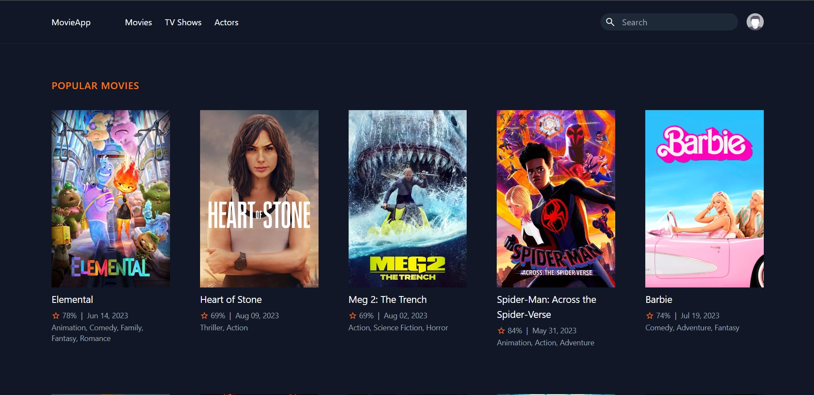
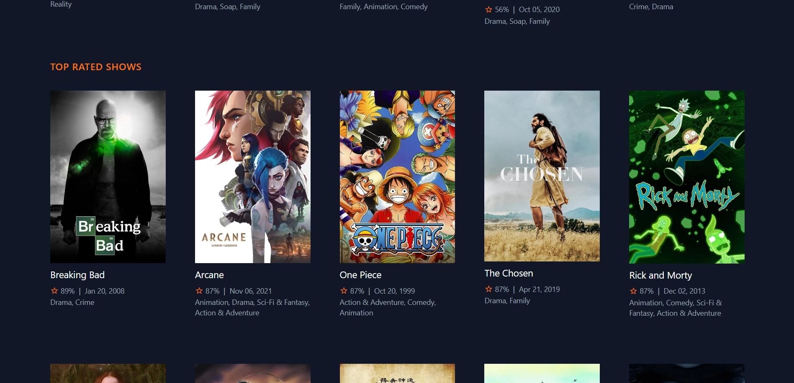
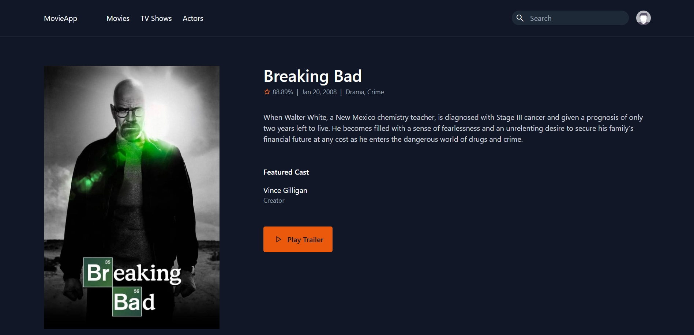
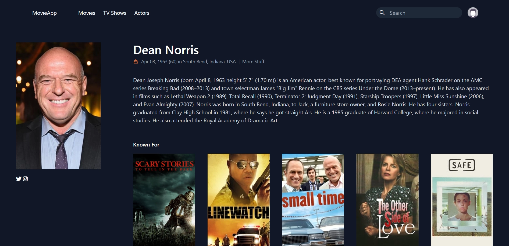

<h1>Usage: </h1>
<ul>
    <li>
        Clone the repository: git clone https://github.com/giochagelishvili/laravel-movies.git
    </li>
    <li>
        Open project folder in code editor: cd laravel-movies
    </li>
    <li>
        Install composer: composer install
    </li>
    <li>
        Start the server: php artisan serve
    </li>
</ul>

<h1>Preview: </h1>

